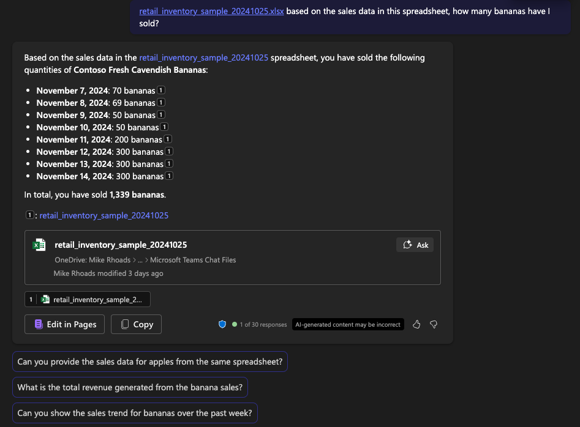

# Contoso Hypermarket Overview

Contoso Hypermarket uses Copilot M365 to analyze vast amounts of data and generate actionable insights. By integrating Copilot into their existing systems, Contoso can predict trends, optimize inventory, and improve customer satisfaction.  Copilot acts as another employee managers and staff can interact with.

# Working with Spreadsheets

Despite the advancements in technology, spreadsheets remain a crucial tool for many businesses, including Contoso Hypermarket. Copilot M365 seamlessly integrates with older formats like spreadsheets, allowing Contoso to:

- Import and Analyze Data: Copilot can import data from spreadsheets, analyze it, and provide insights without the need for manual data entry.
- Generate Reports: Automatically generate comprehensive reports based on the data in spreadsheets, saving time and reducing errors.
- Predictive Modeling: Use historical data from spreadsheets to build predictive models that forecast future trends and demands.

## Key Benefits

Using Copilot in this way offers several benefits including:

- Efficiency: Automates data analysis and report generation, freeing up valuable time for employees.
- Accuracy: Reduces the risk of human error in data analysis and reporting.
- Scalability: Handles large datasets and complex calculations with ease.

## Prerequisites

This module requires access to M365 Copilot.  For information on enabling this within your organization, please refer to [this](https://learn.microsoft.com/en-us/copilot/microsoft-365/microsoft-365-copilot-enable-users) document.

## Getting Started

> **Note:** AI-generated content may be incorrect.  In addition, the screenshots and Copilot responses may differ.

To begin, download the three spreadsheets:
- [retail_inventory_sample](https://download.microsoft.com/download/0832a0b6-bf27-4a3f-bf65-b3404233f9cb/retail_inventory_sample_20241025.xlsx) - this simulates inventory and sales data for Contoso Hypermarket
- footfall_sample - this simulates footfall data derived from in-store cameras
- [contoso_roasters](https://download.microsoft.com/download/c3d7251f-5bd8-447d-a674-51acaf485cf0/contoso_roasters_20241025.xlsx) - this is a production log of coffee roasting

## Prompts

The following table provides example prompts and expected results.  Note that the output will likely vary somewhat from this table, but the overall analysis should be similar.  To browse

| Prompt Text | Expected Result | Source Data | Remarks |
|-------------|-----------------|-------------|---------|
| based on the sales data in this spreadsheet, how many bananas have I sold? | we've sold 1,339 bananas | retail_inventory_sample | note that we did not specify the specific product name; just bananas |
| based on the sales data for apples, which locations in the store sell the most apples? | Stock Locations 1, 2, and 3 are the top locations for selling apples, each selling 25 apples per day, while Stock Location 4 sells 15 apples per day | retail_inventory_sample |
| Provide a summary of coffee roasting production. | Overview of coffee roasting production metrics. | [contoso_roasters](https://download.microsoft.com/download/c3d7251f-5bd8-447d-a674-51acaf485cf0/contoso_roasters_20241025.xlsx) | Check for any missing logs. |